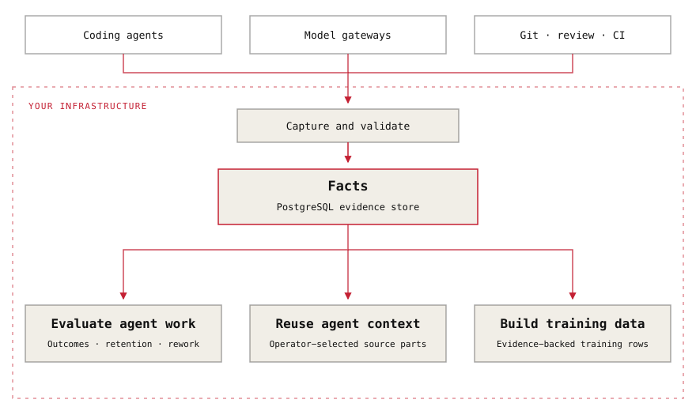

<p align="left">
  <picture>
    <source media="(prefers-color-scheme: dark)" srcset=".github/assets/sediment-logo-dark.svg">
    <source media="(prefers-color-scheme: light)" srcset=".github/assets/sediment-logo-light.svg">
    
  </picture>
</p>

[](https://github.com/sediment-ai/sediment/actions/workflows/ci.yml)
[](https://pypi.org/project/sediment-cli/)
[](CONTRIBUTING.md)
[](LICENSE)
[](https://x.com/sedimentai)

[Website](https://sediment.so) |
[Documentation](https://docs.sediment.so) |
[Changelog](CHANGELOG.md)

<!-- docs-home:start -->

Sediment is an open-source, self-hosted evidence store for coding agents.

Capture model calls, code changes, developer decisions, and check results on
your infrastructure.

- [Evaluate agent work](docs/operate/measure-agent-work.md): compare models by
  recorded decisions, code retention, and automated checks.
- [Reuse context](docs/operate/resume-with-evidence.md): give agents selected
  messages, tool calls, and results from a previous Session.
- [Build training datasets](docs/exports/training-exports.md): export examples
  for fine-tuning, preference training, and reinforcement learning.

<!-- docs-home:end -->

## Get started

On macOS with Homebrew, Debian, or Ubuntu:

```sh
curl -fsSL https://sediment.so/install.sh | sh
sediment server
```

If the installer prints a PATH instruction, run it before `sediment server`.

Sediment manages a local PostgreSQL database. Follow the
[Quickstart](docs/quickstart.md) to connect an agent and verify capture.

[Integrations](docs/capture/agent-integrations.md): Claude Code, Codex, Cursor,
pi, and Copilot Chat. Available signals vary by agent.
[Deploy a shared server](docs/operate/deploy.md).

## Architecture

<p align="center">
  <picture>
    <source media="(prefers-color-scheme: dark)" srcset=".github/assets/architecture-dark.svg">
    <source media="(prefers-color-scheme: light)" srcset=".github/assets/architecture-light.svg">
    
  </picture>
</p>

[Architecture and network boundaries](docs/explanation/architecture.md) ·
[Captured data and privacy](docs/explanation/how-capture-works.md)

## Development

[Contributing](CONTRIBUTING.md) ·
[Issues](https://github.com/sediment-ai/sediment/issues) ·
[Security](SECURITY.md)

## License

[AGPL-3.0](LICENSE). Harness shims under `shims/` use the
[MIT license](shims/pi/LICENSE).
