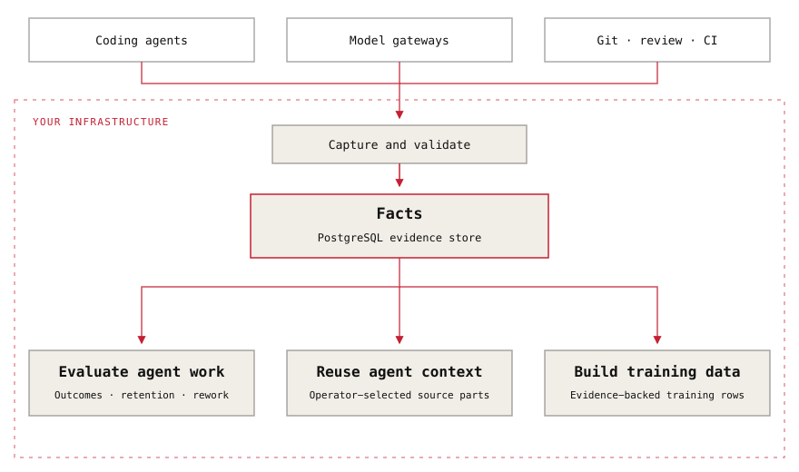

<p align="left">
  <picture>
    <source media="(prefers-color-scheme: dark)" srcset=".github/assets/sediment-logo-dark.svg">
    <source media="(prefers-color-scheme: light)" srcset=".github/assets/sediment-logo-light.svg">
    
  </picture>
</p>

[](https://github.com/sediment-ai/sediment/actions/workflows/ci.yml)
[](https://pypi.org/project/sediment-cli/)
[](CONTRIBUTING.md)
[](LICENSE)
[](https://x.com/sedimentai)
[](https://discord.gg/RbPc6PFTb)

[Website](https://sediment.so) |
[Documentation](https://docs.sediment.so) |
[Changelog](CHANGELOG.md)

<!-- docs-home:start -->

Sediment is an open-source, self-hosted evidence store for coding agents.

Coding agents write a growing share of your code, but you can't tell which of
their output a developer kept, which commits it reached, or whether those
commits passed CI. Sediment records that evidence on your infrastructure: model
calls, code changes, developer decisions, and check results. It links them so
you can compare models, give agents earlier context, and build training data.

**Status:** pre-alpha, version 0.5.0. Interfaces and storage can change between
releases; each release documents its upgrade path.

- [Evaluate agent work](docs/operate/measure-agent-work.md): compare models by
  recorded decisions, code retention, and automated checks.
- [Reuse context](docs/operate/resume-with-evidence.md): give agents selected
  messages, tool calls, and results from a previous Session.
- [Build training datasets](docs/exports/training-exports.md): export examples
  for fine-tuning, preference training, and reinforcement learning.

<!-- docs-home:end -->

## See what you get

`sediment report model` compares models by what happened to their output. This
excerpt comes from synthetic data: 30 Inference calls per model in one
repository.

```text
$ sediment report model --org acme --compare claude-sonnet-4-5 gpt-5-codex
model                        completions attributed        attribution_rate ci_linked ci_passed                 ci_pass  accepts  rejects  mean_sim
claude-sonnet-4-5                     30         24    80.0% [62.7%, 90.5%]        24        21    87.5% [69.0%, 95.7%]       24        6     1.000
gpt-5-codex                           30         18    60.0% [42.3%, 75.4%]        18        13    72.2% [49.1%, 87.5%]       18       12     1.000
...
compare: claude-sonnet-4-5 vs gpt-5-codex
metric           prop_a   prop_b     diff       h   ci_low  ci_high       z   p_value        sig    n_a    n_b
ci_pass_rate      87.5%    72.2%   +15.3%  +0.388    -9.3%   +39.8%    1.25    0.2121         no     24     18  small n, less reliable
attribution_rate    80.0%    60.0%   +20.0%  +0.442    -2.6%   +42.6%    1.69    0.0910         no     30     30
```

A row counts only captured evidence. Here, a 20-point gap in Attribution rate
isn't significant at 30 calls per model, and the report says so.

## Get started

On macOS with Homebrew, Debian, or Ubuntu, the installer adds the CLI and the
host libraries that the local server needs:

```sh
curl -fsSL https://sediment.so/install.sh | sh
sediment server
```

To install the CLI from PyPI yourself, use Python 3.12 or later:

```sh
pip install sediment-cli     # or: uv tool install sediment-cli
```

`sediment server` also needs the PostgreSQL client libraries: `libpq` and
`openssl@3` from Homebrew, or `libpq5 libxml2 libzstd1 liblz4-1 zlib1g` on
Debian and Ubuntu. To preview what the installer changes, run
`curl -fsSL https://sediment.so/install.sh | sh -s -- --dry-run`.

Follow the
[Quickstart](docs/quickstart.md) to connect an agent and verify capture.
If you help an operator run Sediment or a developer install capture, read the
[agent guide](docs/operate/agent-guide.md) or run `sediment guide`.

[Integrations](docs/capture/agent-integrations.md): Claude Code, Codex, Cursor,
pi, and Copilot Chat. Available signals vary by agent.

To run Sediment for a team, [deploy it on EC2](docs/operate/deploy-ec2.md), or
[on your own host](docs/operate/deploy.md) if you already run PostgreSQL and
HTTPS. Then [enroll your team](docs/operate/run-pilot.md).

## Architecture

<p align="center">
  <picture>
    <source media="(prefers-color-scheme: dark)" srcset=".github/assets/architecture-dark.svg">
    <source media="(prefers-color-scheme: light)" srcset=".github/assets/architecture-light.svg">
    
  </picture>
</p>

[Architecture and network boundaries](docs/explanation/architecture.md) ·
[Captured data and privacy](docs/explanation/how-capture-works.md)

## Development

[Contributing](CONTRIBUTING.md) ·
[Issues](https://github.com/sediment-ai/sediment/issues) ·
[Security](SECURITY.md)

## License

[AGPL-3.0](LICENSE). Harness shims under `shims/` use the
[MIT license](shims/pi/LICENSE).
