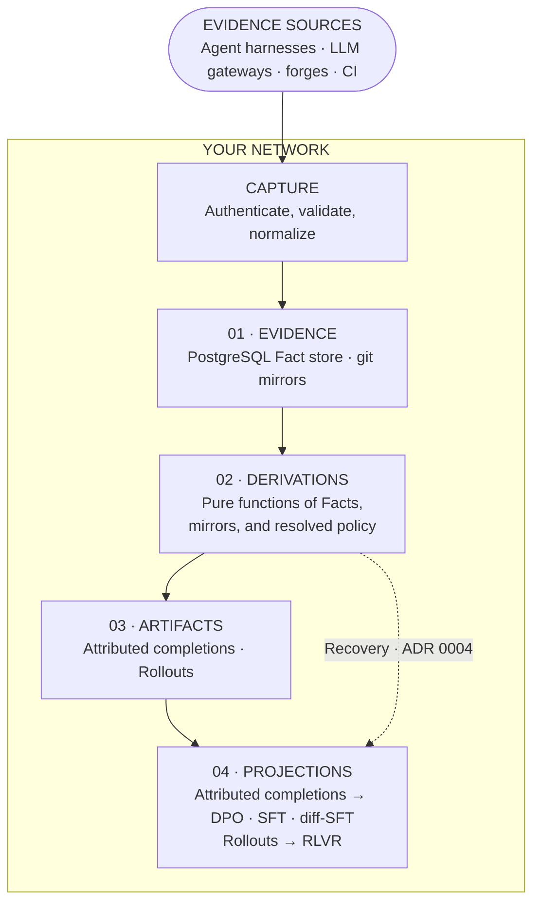

# Architecture

Sediment separates captured evidence from its interpretation. Capture endpoints
append immutable Facts, Derivations interpret those Facts under a policy, and
export projections shape the results for a training objective.

This page explains the components that enforce that separation and the data
that crosses each boundary.

Large language model (LLM) gateways report inference calls, and continuous
integration (CI) systems supply outcomes. The export stage names direct
preference optimization (DPO), supervised fine-tuning (SFT), diff-shaped SFT
(diff-SFT), and reinforcement learning from verifiable rewards (RLVR).

## Component and data flow

<!-- render: beautiful-mermaid -->

The dashed route is the Recovery exception. It bypasses the two canonical
artifacts, not the Derivation rules. Recovery remains a pure Derivation over
Facts and mirror evidence.

## Capture path

Agent harnesses report inference calls, Developer decisions, Edit observations,
and Retry linkages. LLM gateways report inference calls
through callbacks.
Forges and continuous integration (CI) systems report Pushes and CI outcomes.

Capture endpoints authenticate each source, validate its payload, and normalize
it into the Fact schema. The endpoints append the resulting Facts to
PostgreSQL. They don't compute an Attribution, Reward, or training label.

Sediment observes model traffic after an agent harness or gateway reports it.
Sediment doesn't sit in the model request path.

## Stored evidence

PostgreSQL stores immutable Facts. Facts are the only persisted service state,
and capture never changes an earlier Fact to add a later interpretation.

Git mirrors hold repository history and `refs/notes/sediment`. Mirrors provide
commit content, diffs, ancestry, and git-notes Attribution evidence. They form
part of the raw substrate beside PostgreSQL, but they aren't part of the Fact
store.

This division keeps observations exact. A Push records what the forge reported,
while the mirror supplies the repository content that a later Derivation reads.

## Derivation path

A Derivation reads visible Facts, stable git mirror state, and a resolved
policy. It derives relationships such as Attribution, resolves CI evidence, and
assembles training-shaped evidence without changing its inputs.

Derivations are pure and recomputable. The same Facts, mirror state, and policy
produce the same result. Sediment doesn't persist a Derivation's output as
service state. A derived bundle can materialize the result as an immutable
local build artifact without becoming a source of truth.

## Export path

Attributed completions and Rollouts are Sediment's two canonical artifacts. An
Attributed completion resolves evidence around one inference call. A Rollout
represents one Session's full trajectory.

Export projections turn Attributed completions into direct preference
optimization (DPO), supervised fine-tuning (SFT), and diff-shaped SFT
(diff-SFT) rows. A separate projection turns Rollouts into reinforcement
learning from verifiable rewards (RLVR) tasks and trajectories.

Recovery is [ADR 0004's](../adr/0004-canonical-training-artifacts.md) one
sanctioned Fact-derived export exception. Its red-to-green commit-pair shape
can't project from either canonical artifact. The Recovery Derivation therefore
reads eligible Facts and the mirror directly to produce a row with the fixing
diff.

## Operational evidence reads

An operator can inventory a Session, inspect Inference-call message structure,
and fetch selected canonical parts through the existing API. Each read uses one
Quarantine-aware PostgreSQL snapshot and fixed source and response limits. The
CLI publishes the result as a private local packet. Sediment stores no packet,
checkpoint, retrieval index, or inferred task state.

This path reuses captured Facts without changing Attributed completions,
Rollouts, reports, or training projections. A consuming agent treats the packet
as historical data and supplies its own task instructions. No retrieval model
or model-service dependency participates in these reads. See
[Bounded evidence access](../adr/0021-bounded-evidence-access.md) and
[Continue a task with captured evidence](../operate/resume-with-evidence.md).

## Network and trust boundaries

The API, PostgreSQL Fact store, git mirrors, Derivations, and exporters run
inside your network. Developer machines, gateways, forges, and CI systems need
an authenticated route to the capture endpoints.

Capture validates evidence at the ingest boundary. Basic redaction replaces
high-confidence API keys and bearer credentials before PostgreSQL writes a
Fact. Quarantine excludes an unsafe or incorrect Fact from later Derivations
without mutating or deleting the Fact.

Sediment has no phone-home path. Repository mirroring is its only optional
outbound connection. An internal forge can keep capture and mirror traffic
inside an air-gapped network. Evidence reads add no outbound connection. If a
consumer sends a packet to a model, that consumer's configured endpoint decides
whether the content crosses the perimeter.

## Continue reading

- [How Sediment works](how-sediment-works.md) explains the Fact and Derivation
  boundary and the evidence that each training objective uses.
- [How capture works](how-capture-works.md) explains the evidence sources and
  capture limits.
- [How Derivation works](how-derivation-works.md) explains snapshots, policy,
  cohort selection, and the derived bundle.
- [Choose a training export](../exports/training-exports.md) compares export
  objectives and their shared preparation and inspection steps.
