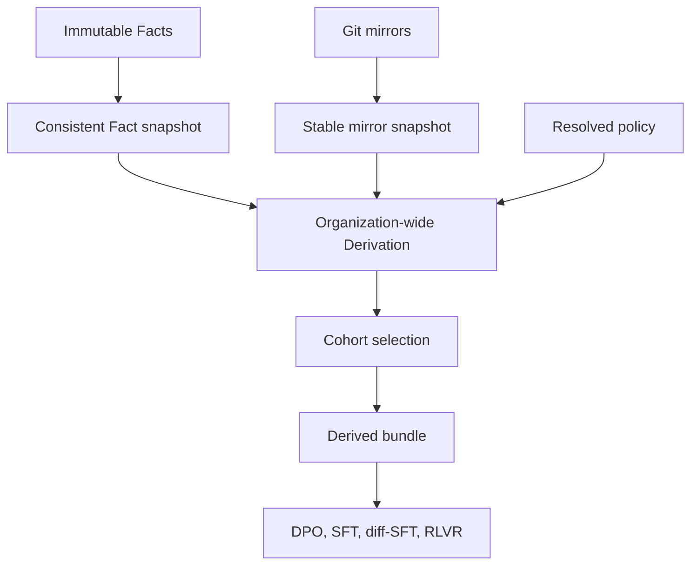

# How Derivation works

Sediment turns immutable Facts into two canonical artifacts: Attributed
completions and Rollouts.

A Derivation is a pure, recomputable interpretation of Facts and git mirror
state under a resolved policy. Sediment can recompute the complete history when
that policy changes without rewriting captured evidence.

This page explains that boundary. [Run
derivations](../operate/run-derivations.md) provides the operating procedure.

The resulting bundle supports direct preference optimization (DPO),
supervised fine-tuning (SFT), diff-shaped SFT (diff-SFT), and reinforcement
learning from verifiable rewards (RLVR).

## The Derivation boundary

The Fact store contains captured Facts. It contains no chosen Attribution, edit
retention score, final Fate, Reward, or Rollout. Those depend on policy and
belong on the derived side.

Merge retention is another diagnostic Derivation. A captured observation must
first qualify the Attribution's exact repository, commit, and Session. The
Derivation then joins one pull request through the final head, captured revision
heads, or exact CI evidence. It then compares the attributed addition with the final head and
merged commit. It doesn't alter a canonical artifact or supply training
eligibility.

A CI outcome preserves one provider run attempt and its structured evidence.
Only `passed` and `failed` supply a binary CI verdict. Neither result proves
code quality.

`CIResolutionPolicy` groups attempts by provider run identity. It orders them
only by `run_attempt`. A null attempt sorts as 0 when mixed with numbered
attempts.

The policy never uses capture time, ingest order, URL, or generated IDs to
order attempts. A failure-then-pass retry resolves to pass. It also records
suspected-flake evidence and reliability 0.0 by default.

Infrastructure errors and other non-verdicts remain evidence without a
direction. The Fact store never records `is_flake`, code causality, or a
resolved Reward.

Several agreeing workflow lineages use their minimum reliability. Conflicting
workflow verdicts produce no aggregate verdict and count
`ambiguous_workflow_verdicts`.

Every projection recomputes this resolution from the exact immutable Facts.

`sediment derive` materializes that view as an immutable local build artifact.
The bundle isn't service state and never writes results back to the Fact store.
Deleting it loses no source data. The same inputs reproduce it.

Complete evidence and resident content have different lifetimes. Compact identity
populations span the required organization scope. Content can pass through
complete dependency groups and private file-backed bundle sequences. Validation
retains every source relationship without retaining every raw payload together.
[ADR 0020](../adr/0020-bounded-derivation-execution.md) defines this execution
contract and explicit capacity failures.



## A coherent input view

A run holds one read-only, repeatable-read PostgreSQL snapshot while it reads
Facts and the quarantine revision. Capture can continue concurrently. The run
doesn't observe Facts appended after its snapshot begins.

The run also locks every relevant mirror in sorted repository order. While the
Derivation holds those locks, a fetch, rename, garbage-collection action, or
removal can't change git objects or notes.

Sediment counts a missing mirror as a data-quality skip.

The manifest records the integer quarantine revision, the newest visible Fact
timestamp as `as_of`, and the mirror refs used by the run. It doesn't record a
generation timestamp, because wall-clock time isn't a Derivation input.
Observation boundary selection and comparisons use UTC instants, including
when preloaded Facts carry repeated local times during daylight-saving changes.

## Full Derivation before cohort selection

Sediment reads `SEDIMENT_ORG_ID` from the environment and uses that organization
as the Derivation scope. It derives the complete organization before it applies
user or time filters.

An Attributed completion qualifies through its referenced inference call.
`--since` is inclusive, and `--until` is exclusive. Both filters use
inference-call observation time.

A Rollout qualifies by time when at least one inference call in the Session
falls inside the interval. Sediment keeps the complete Rollout.

If `--users` is present, every inference-call user in a Rollout must appear in
the allowlist. Sediment excludes and counts a Rollout that crosses that
boundary.

If you omit `--users`, Sediment derives across every user in the configured
organization. Time bounds never add an implicit user filter.

## One policy for both artifacts

The resolved Attribution policy feeds both Attributed completions and
Rollouts. The Session-level split primitive applies the same split fraction to
both artifacts. Decision attachment checks uniqueness over the supplied candidate
population, then requires the Inference call and Developer decision to share
organization and Session. Assembly checks organization-wide ambiguity; Rollout
checks each Session independently.

One policy prevents the artifacts in a bundle from carrying different
Attribution or holdout semantics.

The policy digest identifies the complete resolved configuration, including
defaults. Provenance carries the implementation version, integer quarantine
revision, and complete resolved-policy digest:

```json
{
  "policy_version": "5",
  "quarantine_revision": 0,
  "policy_digest": "8d94a1c2c41f40f9f02656ab8ac26792e495755a69bf064b20e96067edba509b"
}
```

Changing a policy value changes the digest. Changing Derivation behavior
requires an implementation-version bump. Either change makes two datasets
visibly distinct. The defaults are Attribution 2, Attributed completion assembly
4, and Rollout 3. Caller-supplied version strings label the running algorithm;
they don't run a historical implementation.

## Train and evaluation isolation

A split divides rows into training and evaluation partitions. Training rows
can influence model weights. Evaluation rows stay held out so they can measure
behavior that training didn't expose.

Sediment supports one split rule: it hashes the Session identifier. Every row
from one Session stays in one partition across Attributed completions and
Rollouts.

This rule prevents shared message prefixes and other near-duplicate rows from
one workflow from crossing the boundary.

Holdout boundaries differ by the identity that must remain on one side:

| Boundary | What stays on one side | Use case | Where it's enforced |
|---|---|---|---|
| Session | All rows from one Session | Keep one workflow's near-duplicate rows together | Derivation policy, through `eval_fraction` |
| Repository | Every row from one repository | Measure performance on an unseen codebase | Benchmark manifest only |
| Prompt | Rows with the same exact structured prompt | Measure performance on unseen prompts | Benchmark manifest only |
| Strict | Any rows linked by Session, repository, or exact prompt | Minimize leakage through all three identities | Benchmark manifest only |

Task identity is study-specific. A task-keyed pilot therefore belongs in its
versioned benchmark manifest, outside the final holdout.

The Derivation policy implements only the Session boundary through
`eval_fraction`. It rejects a `split.mode` field because no mode value exists.
Repository, prompt, strict, and task-keyed boundaries remain
benchmark-specific.

A benchmark manifest must enforce those stronger holdouts. Its export audit
must confirm the boundary before training. A Session split alone doesn't
support a stronger generalization claim.

## The canonical bundle

A successful run writes seven files:

```text
derived/
|-- manifest.json
|-- attributed_completions.jsonl
|-- rollouts.jsonl
|-- inference_calls.jsonl
|-- inference_call_identities.jsonl
|-- repository_identities.jsonl
`-- repository_renames.jsonl
```

`inference_calls.jsonl` contains every inference-call Fact referenced by a
selected Attributed completion or Rollout and no unrelated calls. Each row keeps
structured input and output messages.

The Derivation uses `render_scoring_text` when it needs a scalar response. The
pure renderer combines model-produced text with string leaves from tool-call
arguments.

The renderer excludes readable reasoning and tool responses. It never
persists the rendered value.

Bundle version 4 declares `record_encoding: "sediment-record-json-v1"` and
`identity_population: "organization-through-as-of-v1"`. The file
`inference_call_identities.jsonl` contains every visible organization call's
identity, Session, observation time, and distinct provider/tool aliases through
`as_of`. Cohort selection doesn't narrow this population. An explicitly empty
population is valid; omitted evidence isn't. The 50,000-row identity limit
refuses incomplete populations, including when the selected cohort is small.
Every artifact line contains exactly one `record_json` string. The string holds
one canonical record encoded with ASCII escapes and the declared Python numeric
extensions `NaN`, `Infinity`, and `-Infinity`. The manifest and outer lines are
strict JSON. This preserves NUL, surrogate strings, exceptional numbers, empty
values, and null without changing Fact meaning.

`repository_identities.jsonl` contains every visible repository source role,
including explicit identity absence. `repository_renames.jsonl` contains every
visible Repository rename. Each population has an independent 50,000-row cap
and remains complete through `as_of` before cohort selection. The manifest
declares this boundary with `repository_population`. The validator checks
retained source Push anchors and exact CI and observation projections against
these populations. The declaration cannot prove that an external producer
supplied every Fact. Bundle versions 1–3 require recomputation from Facts.

Each JSONL file has a fixed row order and deterministic encoding. Counts and
SHA-256 digests cover the exact outer bytes. Both decoders reject duplicate
object keys and trailing payload data. Unknown fields and encodings fail.

Public `validate_derived_bundle` checks canonical relationships before write,
after read and before bundle-based training, including in-memory exports. Every
Attributed completion and Rollout Turn references exactly one included Inference
call with the same organization and Session and agrees with its identity witness.
Decisions attach uniquely over organization evidence for Attributed completions
and Session evidence for Rollouts. Every carried Rollout retains all declared
Session calls; the pure Rollout owner reconstructs its Turn content and boundaries.
CI evidence matches a repository-qualified commit. The validator also checks the
Session split, Provenance, and consistent repeated Fact identities. The existing
assembly retention projection can fill an absent Decision score in Attributed
completions while Rollout keeps the captured null. Every other captured field
must agree, captured scores stay unchanged, and derived copies share one score.

Canonical artifacts embed matching `SessionCommitObservation` Facts. The builder
sets `as_of` from its snapshot before either artifact binds observations. The
validator requires matching organization, Session, repository, commit, and
`captured_at <= as_of`. Empty observation tuples remain valid inferred artifacts;
they don't establish factual outcomes or individual call-to-file authorship.

The reader never substitutes live data or repairs an imported relationship.
Versions 1 and 2 receive an unsupported-version error requiring recomputation.
Their published schemas remain available. Validation and serialization failures
leave existing destinations intact; a writer never overwrites a bundle.

The producer declares source population completeness. Offline validation can't
prove that an external producer disclosed every Fact or that the source was
truthful. The identity budget doesn't bound message bytes or database scan work.
The bundle contract treats completeness as a producer assertion rather than a
validation result.

Rollout version 3 checks typed prior input and captured output before continuing
a Segment. The Derivation retains every Turn and records each unproven boundary
in the manifest's required `fragmented` map: `prior_output_absent`, `input_history_changed`, or
`prior_output_not_replayed`. These counts describe retained Turns; `skipped`
describes declined inputs or artifacts.

The manifest keeps two kinds of absence separate:

- `skipped` counts data-quality gaps such as `mirror_absent`.
- `excluded` counts intended cohort filters such as a user or time boundary.

This distinction separates an incomplete Derivation from an intentionally
narrow cohort.

## Separate projection

`sediment derive` computes and freezes the two canonical artifacts. It doesn't
choose a training format. `sediment export --from` validates the bundle, then
projects it into DPO, SFT, diff-SFT, or RLVR rows.

Projection policies remain outside the Derivation policy because they don't
change the canonical artifacts. Each projection applies one versioned Evidence
recipe and records its label or eligibility source.

The conservative defaults use human-explicit evidence for DPO and curated
human or edit-retention evidence for SFT. Outcome-derived recipes require
explicit selection.

Recovery remains separate. A red-to-green commit pair is the one sanctioned
Fact-derived training-row shape. It isn't a projection of an Attributed
completion or Rollout. Sediment persists no recipe decision as a Fact or
canonical artifact.

[Attribution](attribution.md) explains the hardest join in the Derivation.
[How Sediment works](how-sediment-works.md) places Derivation in the complete
capture-to-export pipeline.
