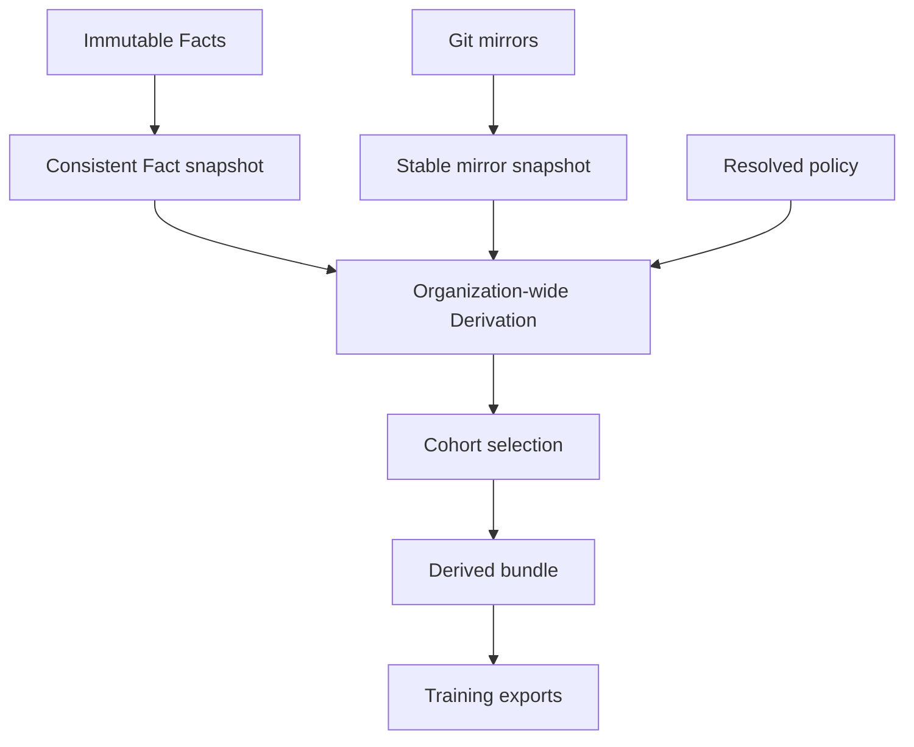

# How Derivation works

A Derivation turns captured Facts and Git mirror evidence into two canonical
artifacts: Attributed completions and Rollouts. It applies a resolved policy
without changing the source Facts. The same inputs and implementation reproduce
the same result.

[Run derivations](../operate/run-derivations.md) is the starting point for
building and reviewing a bundle. This page explains what happens during that
run, from the input snapshot to training export.

## The Derivation boundary

The Fact store records what happened, including vendor-supplied edit retention
scores. It doesn't persist Sediment's derived Attribution, recomputed edit
retention scores, final Fate, Reward, or Rollouts. Those interpretations belong
to Derivations because they depend on policy.

A bundle saves Derivation output as an immutable local artifact. It isn't
service state and doesn't write results back to the Fact store. Deleting the
bundle leaves the source evidence intact. Reproducing it requires the same
Facts, quarantine state, mirror evidence, policy, and implementation.

The pipeline keeps Derivation separate from cohort selection and export:

```mermaid
flowchart TB
  F[Immutable Facts] --> S[Consistent Fact snapshot]
  M[Git mirrors] --> G[Stable mirror snapshot]
  S --> D[Organization-wide Derivation]
  G --> D
  P[Resolved policy] --> D
  D --> C[Cohort selection]
  C --> B[Derived bundle]
  B --> E[Training exports]
```

## A coherent input view

A run reads the configured organization through one read-only, repeatable-read
PostgreSQL snapshot. It sees a consistent set of Facts and quarantine state
while capture continues. Facts appended after the snapshot begins belong to a
later run.

The run also locks the relevant mirrors in sorted repository order. Fetches,
renames, garbage collection, and removal can't change their Git objects or notes
while the run holds those locks. Sediment counts missing mirrors under `skipped`.

The manifest records the quarantine revision and mirror refs. Its `as_of` is the
latest visible source timestamp, not a generation time or a requested cohort
boundary. An empty organization has no `as_of`. Time comparisons use coordinated
universal time (UTC), including across daylight-saving changes.

## One policy for both artifacts

The resolved policy includes every configured value and its defaults. One
Attribution policy feeds both Attributed completions and Rollouts. One Session
split assigns their training and evaluation partitions.

The artifacts organize evidence differently:

| Artifact | What it represents |
| --- | --- |
| Attributed completion | An Inference call with Developer decisions, retention, and outcome evidence. It carries either Attribution or a `SessionAbandonment` variant. |
| Rollout | A Session's ordered Turns, grouped into Segments with proven continuity and linked commit evidence. |

[Attribution](attribution.md) explains the join between Inference calls and
commit files. A Developer decision must also match a unique Inference call in
the same organization and Session. Attributed completion assembly checks
ambiguity across organization evidence; Rollout assembly checks within each
Session.

The policy digest identifies the complete resolved configuration. Each
artifact's Provenance records that digest, the quarantine revision, and its
implementation version. The manifest records the implementation versions for
the bundle. A policy change changes the digest; a behavior change requires an
implementation-version change. A version label doesn't run a historical
implementation.

### Train and evaluation isolation

Sediment hashes the Session identifier to assign each Session to training or
evaluation. All rows from that Session stay in one partition across both
artifacts. The default `eval_fraction` is `0.1`; `0.0` disables the split.

This keeps one workflow's shared message history out of the opposite partition.
It doesn't isolate identities that span several Sessions:

| Boundary | What stays in one partition | Enforcement |
| --- | --- | --- |
| Session | All rows from one Session | Derivation policy |
| Repository | Every row from one repository | External benchmark manifest |
| Prompt | Rows with the same exact structured prompt | External benchmark manifest |
| Task | Rows for the study's task identity | External benchmark manifest |
| Combined | Rows linked by Session, repository, or exact prompt | External benchmark manifest |

The policy rejects `split.mode`; it supports only `eval_fraction`. Stronger
holdouts depend on a versioned benchmark manifest and an export audit. A Session
split alone doesn't support a claim about performance on unseen repositories,
prompts, or tasks.

## Full Derivation before cohort selection

Sediment derives the complete organization in `SEDIMENT_ORG_ID` before applying
user or time filters. This preserves the evidence needed to detect ambiguous
joins. A small output cohort can still require organization-wide evidence.

An Attributed completion qualifies through its Inference call. Time selection
uses that call's observation time, with an inclusive start and exclusive end.
A Rollout qualifies when at least one of its Inference calls falls within the
interval. Sediment retains the complete Rollout.

When the cohort specifies users, every Inference call user in a Rollout must
belong to that list. Sediment excludes and counts mixed-user Rollouts. Without a
user filter, all users in the organization remain eligible. Time bounds don't
add an implicit user filter.

## The canonical bundle

A successful run writes seven files:

| File | Contents |
| --- | --- |
| `manifest.json` | Scope, resolved policy, Provenance inputs, counts, diagnostics, and file hashes. |
| `attributed_completions.jsonl` | Selected Attributed completions. |
| `rollouts.jsonl` | Selected complete Rollouts. |
| `inference_calls.jsonl` | Every Inference call referenced by the selected artifacts, with structured input and output messages. |
| `inference_call_identities.jsonl` | Complete organization-wide call identities through `as_of`, including Sessions, observation times, and provider/tool aliases. |
| `repository_identities.jsonl` | Complete repository source roles through `as_of`, including explicit identity absence. |
| `repository_renames.jsonl` | Complete Repository rename evidence through `as_of`. |

The three identity and rename populations include evidence outside the selected
cohort. Each has an independent 50,000-row cap. An explicitly empty population
is valid; omitted evidence isn't. The limits apply even when the output cohort
is small.

### Validation and representation

Bundle version 4 declares `record_encoding: "sediment-record-json-v1"`.
Each JSON Lines (JSONL) row contains one `record_json` string holding the
canonical record. The outer row and manifest use strict JSON. The inner encoding
preserves empty values, null, unusual Unicode, and the declared Python numeric
extensions `NaN`, `Infinity`, and `-Infinity`. The
[Lossless representation contract](../adr/0015-lossless-values-and-bundle-v2.md)
defines these distinctions.

Files use deterministic row order and encoding. Counts and hashes cover their
exact bytes. Readers reject duplicate keys, trailing payload data, unknown
fields, and unsupported encodings. Bundle versions 1–3 require recomputation
from Facts.

The validator checks the complete bundle before writing, after reading, and
before bundle-based training. Its checks include:

- Inference call references, organization and Session identity, and unique
  Developer decision attachment.
- Complete Session calls, reconstructed Turn content, and Segment boundaries.
- Repository-qualified commit and CI evidence, source Push anchors, and
  Session-to-commit observations through `as_of`.
- Session splits, Provenance, and consistent repeated Fact identities.

Attributed completion assembly can derive an absent decision retention score
while a Rollout preserves the captured null. Captured scores stay unchanged;
all other captured fields must agree. The reader never repairs an imported
relationship or substitutes live data. Empty Session-to-commit observation
collections remain valid, but don't establish factual outcomes.

Validation checks consistency against the populations that the producer
supplies. It can't discover undisclosed Facts or establish that external source
evidence is truthful. The bundle contract treats completeness as a producer
assertion rather than a validation result.

### Diagnostic counts

The manifest separates three kinds of diagnostic:

| Field | Meaning |
| --- | --- |
| `skipped` | Inputs or artifacts that fail eligibility or data-quality checks, such as missing mirrors. |
| `excluded` | Artifacts removed by the requested user or time filters. |
| `fragmented` | Retained Turns whose continuity with the previous Turn isn't proven. |

Rollout continuity compares typed prior input and captured output. When that
comparison can't prove continuity, the Turn starts a separate Segment. The
reasons are `prior_output_absent`, `input_history_changed`, and
`prior_output_not_replayed`. Fragmentation preserves every Turn; it doesn't
mean that Sediment dropped the evidence.

### Bounded execution

Sediment keeps complete identity populations while processing content in
complete dependency groups. Private file-backed storage lets it validate source
relationships without holding every raw payload in memory together. Capacity
failures stop the operation instead of truncating evidence.
[Bounded Derivation execution](../adr/0020-bounded-derivation-execution.md)
defines the storage and memory contract. Identity row limits don't bound message
bytes or database scan work.

## Separate projection

Derivation freezes the canonical artifacts before an export chooses a training
objective. Bundle-based exports validate those artifacts, then apply one
versioned Evidence recipe. Each recipe records the sources of labels,
eligibility, and Reward.

Direct preference optimization (DPO) defaults to human-explicit evidence.
Supervised fine-tuning (SFT) defaults to curated human or edit-retention evidence.
Outcome-derived recipes require explicit selection. The bundle also supports
diff-shaped SFT (diff-SFT) and reinforcement learning from verifiable rewards
(RLVR). [Choose a training export](../exports/training-exports.md) maps these
objectives to their evidence requirements.

### CI evidence and verdicts

A captured CI outcome records one provider run attempt and its evidence. Only
`passed` and `failed` provide a binary verdict; neither proves code quality.
Exports recompute CI resolution from the immutable outcomes. Bundle row order
isn't semantic attempt order.

`CIResolutionPolicy` groups attempts by provider run identity and orders them
by `run_attempt`. A null attempt sorts as 0 alongside numbered attempts. Capture
time, ingest order, URLs, and generated identifiers don't determine that order.
A failure-then-pass retry resolves to pass with suspected-flake evidence and
default reliability 0.0.

Agreeing workflow lineages use their minimum reliability. Conflicting verdicts
produce no aggregate verdict and count `ambiguous_workflow_verdicts`.
Infrastructure errors and other non-verdicts carry no binary direction. The Fact
store never persists `is_flake`, code causality, or a resolved Reward.

### Related Derivations

Recovery is the sanctioned exception to canonical-artifact projection. It builds
a red-to-green commit pair from Facts and mirrors directly. Its Evidence recipe
decisions don't become Facts or canonical artifacts.

Merge retention is diagnostic. It requires a captured observation for the exact
repository, commit, and Session before joining a pull request through its final
head, captured revisions, or exact CI evidence. It compares attributed additions
with the final head and merged commit. It doesn't change the canonical artifacts
or supply training eligibility.
[Measure agent work](../operate/measure-agent-work.md) covers that report.
