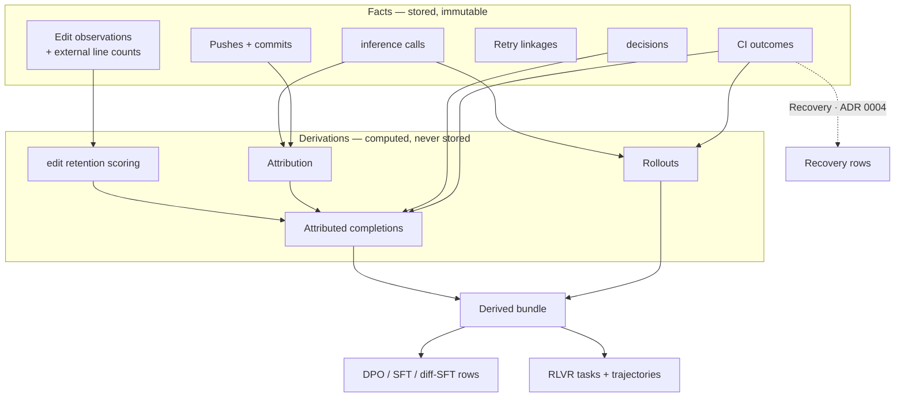

# How Sediment works

Sediment is the open-source, self-hosted evidence store for coding agents. It
captures the evidence that your coding workflow produces: a model writes code,
you accept or reject it, the code changes, a commit reaches review or merge, or
continuous integration (CI) reports a result.

Those signals live in separate systems. Sediment preserves each observation
and joins them without presenting any one signal as ground truth.

You can use the same captured evidence to:

- [Evaluate agent work](../operate/measure-agent-work.md) through model outcomes,
  code retention, and rework reports.
- [Provide context to an agent](../operate/resume-with-evidence.md) by selecting
  captured Inference-call parts for a task continuation.
- [Build training datasets](../exports/training-exports.md) with evidence and
  Provenance attached to each row.

Evidence reads return captured content without a model call. Reports and training
exports interpret Facts through recomputable Derivations. Selecting context does
not change the Facts or their interpretation for training.

This page explains that design. The [Quickstart](../quickstart.md) provides a
working local setup.

[Why Sediment?](operational-value.md) answers the key questions about model
outcomes, retained code, and rework.

## Facts and Derivations

Sediment sorts everything into Facts and Derivations. That split drives
almost every other design choice.

A **Fact** is something that happened: an inference call arrived, a developer
accepted an edit, a forge reported a Push, or CI failed.

Sediment appends Facts and never changes them. It doesn't correct, enrich, or
annotate them. Facts are the only data that Sediment stores.

A **Derivation** is a pure function of Facts and a policy. The Sediment service
doesn't store which commit an inference call produced, how much of an edit
remained, or which CI verdict applies.

Sediment computes those values on demand. The same computation over the same
Facts gives the same answer. An operator can materialize the result as an
immutable local build artifact with `sediment derive`.

The bundle never writes derived state back to the Fact store.

The derived artifacts support direct preference optimization (DPO),
supervised fine-tuning (SFT), diff-shaped SFT (diff-SFT), and reinforcement
learning from verifiable rewards (RLVR).

An uncertain interpretation can improve. When a git note is absent, the
matcher estimates which inference call produced a commit. A later policy can
use a better similarity scorer or a threshold tuned from real traffic.

If Sediment stored that estimate, only later captures would benefit from an
improved policy. Earlier exports would keep the old interpretation. Because
Sediment derives the estimate, the improved policy can score the complete
history again from the original Facts. A candidate below an earlier threshold
remains available for another Derivation.

This boundary also removes webhook arrival order from the result. A Derivation
reads Facts, not arrival order. The tradeoff is recomputation. A derived bundle
lets several exports reuse one reviewed computation.

Quarantine handles an unsafe or incorrect Fact without mutation. Examples
include a captured credential, a forged webhook, and a translator defect.

An append-only quarantine table records each action. Every Derivation-facing
read consults that table. The next Derivation excludes quarantined Facts from
every derived dataset.

The Facts stay on disk for audit.

## Attribution between inference calls and commits

Joining an inference call to a commit is the hardest relationship to recover.
Sediment uses two Attribution sources.

The deterministic path uses a git hook to stamp each commit with the Sessions
that contributed to it in `refs/notes/sediment`. When that stamp exists,
Sediment reads a recorded relationship rather than estimating one.

Sediment uses similarity only to rank which inference call inside the Session
was responsible.

The fallback estimates the relationship. Sediment measures token overlap
between generated code and the commit's changed files. A score above the
policy threshold produces a jaccard Attribution.

Each Attribution carries an `attribution_source`. Confidence discounts a
guessed Attribution by its similarity score. It never discounts a stamped
Attribution.

Repository git hooks provide the deterministic stamp. [Configure local
capture](../capture/local-capture.md#git-hooks) covers their installation.
[Attribution](attribution.md) explains both sources.

## Edit retention before commit

A Developer decision records one moment. The file at Session end provides a
second observation.

Sediment captures the model-written text and the file's Session-end state. It
then derives how much of the edit remained.

A low edit retention score can mean that the agent revised itself or that an
external actor changed the file. External line counts preserve that
distinction without claiming that the actor was human.

A final Fate Derivation maps each score to `deleted`, `partially_modified`,
or `unmodified`. Reports expose Fate as a diagnostic only; it never enters an
Evidence recipe or a training row.

[How capture works](how-capture-works.md#edit-retention-and-external-deltas)
explains containment scoring, edit windows, the local hash cache, and the
measurement's limits.

## Canonical artifacts

Two kinds of training need different shapes. Sediment produces two
canonical artifacts.

An **Attributed completion** carries one complete Attribution and its attached
evidence. Several file Attributions can reference one Inference call.

The schema retains the legacy Session-abandonment variant with every Attribution
field absent. Assembly accepts that supplied evidence only with a uniquely joined
human-explicit accept; the Fact-derived path cannot infer abandonment from a
missing commit observation. Implicit accepts don't become training negatives.

Both variants carry Provenance and a deterministic train/eval split. DPO, SFT,
and diff-SFT are thin projections over this artifact, so those formats can't
fork its joins.

A **Rollout** is the Session-level view: a complete agent trajectory with
terminal CI evidence. Sequence-based reinforcement learning needs that shape.
An Attributed completion can't express it.

The `sediment derive` command freezes both artifacts in one bundle. The bundle
also contains their referenced inference calls, resolved policy, scope, input
Provenance, and integrity hashes. [How Derivation
works](how-derivation-works.md) explains that contract.

One export sits outside both canonical artifacts. The Recovery pair is a clean
red-to-green CI transition that carries the fixing diff.

Its shape is a pair of commits. That shape doesn't project from either
canonical artifact, so Sediment derives it directly from Facts.
[ADR 0004](../adr/0004-canonical-training-artifacts.md) names it the
single sanctioned exception rather than a precedent.

## Evidence by training objective

Training evidence isn't one binary judgment. A rich positive row can show that
you accepted the code, most of it remained at Session end, it reached a
commit, it survived later history changes, and CI passed.

Each step is a separate observation. A row can be strong on some and weak on
others.

A captured Session-to-commit observation establishes that Session relationship.
It doesn't identify which Inference call produced a file. Without the
observation, a factual Session outcome stays unknown and counts a coverage gap.
Elapsed time and mirror availability cannot prove abandonment.

Version 1 Evidence recipes still accept their declared inferred Attribution
sources. Training metadata names those sources and any matching observation IDs.
Recovery remains the only training-row exception that consumes its own
Fact-derived evidence; missing commit evidence doesn't become a negative label.

Each projection selects one versioned Evidence recipe. Human DPO uses only
human-explicit accepts and rejects. Outcome DPO uses only clean resolved CI
passes and failures.

Curated SFT uses explicit accepts or strong edit retention, with negative
evidence as a veto. Verified SFT uses clean resolved CI passes.

The row records the recipe and source instead of presenting these different
claims as one quality label.

This evidence still isn't truth. A CI pass means that recorded checks found no
failure. A CI failure doesn't prove that the code was bad.

A timeout, error, cancellation, skip, neutral result, or unknown result carries
no positive or negative verdict.

A developer who accepts an edit might have judged it correct or acted in a
hurry. Text that survives to Session end means only that nothing changed it
before capture ended.

Sediment states exactly what it observed through `attribution_source`, external
line counts, Provenance, Evidence recipe metadata, and Confidence.

CI outcome Facts preserve provider run and attempt identity, the provider
result, the normalized result, and structured error evidence. Flake and
code-causality assessments remain recomputable Derivations.

The labels remain evidence, not verdicts.

Sediment leaves unknowable values absent and counts each omission under a
closed reason. It never infers a value to make a row look complete. This rule
favors a smaller dataset over fabricated evidence.

## Where the design is written down

The [architectural decision records](../adr/) contain the binding decisions
and record what we rejected. The [domain context](../../CONTEXT.md) defines
Sediment's vocabulary.
